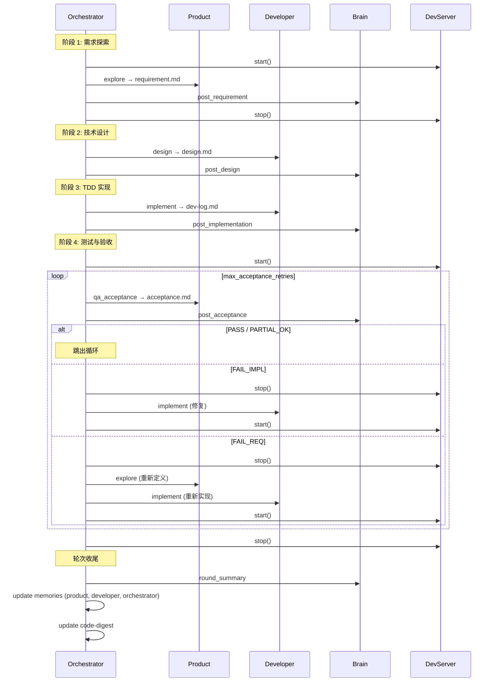
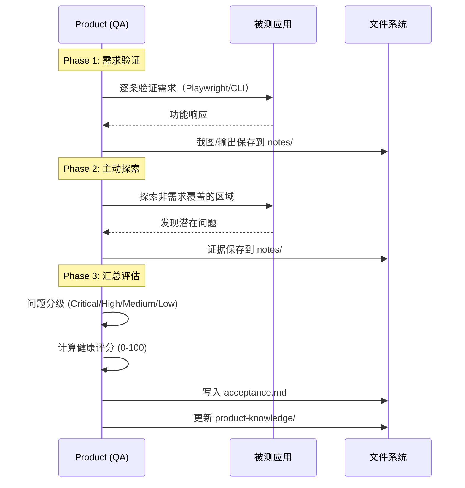

# Implementation Plan: 去掉 Reviewer 角色，Product 承担测试与验收

**Workspace**: `merge-reviewer-into-product` | **Date**: 2026-04-16 | **Spec**: [spec.md](spec.md) | **Explore**: [explore.md](explore.md)
**Input**: Feature specification from `specs/merge-reviewer-into-product/spec.md`

---

## Summary

去掉独立的 Reviewer 角色和代码审查阶段，将流程从 5 阶段简化为 4 阶段。Product 角色新增 `qa_acceptance` 阶段，融合 gstack QA 理念（系统化探索、证据驱动、问题分级、健康评分），替代原来的被动验收。改动涉及 orchestrator 编排流程重构、Brain 决策点精简、context 依赖更新、product prompt 增强，以及对应的全量测试修正。

---

## Key Design Decisions

### Decision 1: `fix_review` 阶段保留但不调用

- **背景**: Spec 明确"不修改 Developer 角色的任何行为"，但 `fix_review` 阶段仅在 review loop 中被调用
- **选项**:
  - A: 从 DeveloperRole 中删除 `fix_review` — 更干净，但违反 spec 约束
  - B: 保留 `fix_review` 代码，仅从 orchestrator 流程中移除调用 — 遵守 spec，代码无害
- **结论**: 选 B，保留 `fix_review`。ContextCollector 中的 `developer:fix_review` 依赖也保留
- **后果**: DeveloperRole 中有一个未被编排器调用的阶段，未来可手动或扩展场景复用

### Decision 2: `max_review_retries` 配置字段保留但不使用

- **背景**: 旧 config.yaml 可能包含此字段，删除会导致 dataclass 解析问题
- **选项**:
  - A: 从 LimitsConfig 中删除 — 简洁但破坏向后兼容
  - B: 保留字段，新代码不读取 — 兼容旧配置
- **结论**: 选 B，保留字段。不加 deprecation warning（spec 未要求）
- **后果**: LimitsConfig 中有一个"死"字段，但确保旧项目无缝升级

### Decision 3: `product:qa_acceptance` 是新 phase name，`acceptance.md` 保持原文件名

- **背景**: Brain 的 `post_acceptance` 决策点读取 `acceptance.md`，改文件名会牵动 Brain 配置
- **选项**:
  - A: 新阶段用新文件名 `qa-acceptance.md` — 语义清晰但改动面大
  - B: 保持 `acceptance.md` 文件名 — Brain 零改动
- **结论**: 选 B，保持 `acceptance.md`。Phase name 变更为 `qa_acceptance` 仅影响 prompt 构建和编排调用
- **后果**: Brain 的 `DECISION_POINT_FILES["post_acceptance"]` 不需要修改

### Decision 4: state.retry_counts 中的 `"review"` 键保留

- **背景**: LoopState 的默认值和 complete_round() 重置逻辑中都含 `"review": 0`
- **选项**:
  - A: 删除 `"review"` 键 — 可能导致旧 state.json 加载时 KeyError
  - B: 保留键 — 兼容旧数据，不影响新逻辑
- **结论**: 选 B，保留。orchestrator 不再使用 review loop，此键只是冗余数据
- **后果**: state.json 中有无用字段，但保证向后兼容

---

## Module Design

### Module: ProductRole（`ai_loop/roles/product.py`）

**职责**: 产品经理角色，负责需求探索、设计澄清、测试与验收

**改动概述**: 新增 `qa_acceptance` 阶段，替代原 `acceptance` 阶段。新 prompt 融合 gstack QA 理念。

**新增/变更接口**:

```
build_prompt(phase, ...)  // 变更：phase 支持 "qa_acceptance"，不再支持 "acceptance"
_qa_acceptance_prompt(round_num, round_dir, goals_text)        // 新增：统一入口
_qa_acceptance_prompt_web(round_num, round_dir, goals_text)    // 新增：web 项目 QA 验收
_qa_acceptance_prompt_cli(round_num, round_dir, goals_text)    // 新增：CLI 项目 QA 验收
```

**核心流程变更**:

```
build_prompt:
1. phase map 中删除 "acceptance"
2. [新增] 加入 "qa_acceptance" → _qa_acceptance_prompt
3. _qa_acceptance_prompt 根据 verification.type 分发 web/cli

_qa_acceptance_prompt_web:
1. 角色定位：你是 QA 工程师兼产品经理
2. [新增] 系统化探索：先验证需求条目，再主动探索产品寻找未覆盖的问题
3. [保留] 编写 Playwright 脚本访问 base_url
4. [保留] 截图作为证据
5. [新增] 问题分级：Critical / High / Medium / Low
6. [新增] 健康评分：0-100，基于 gstack 评分公式
7. [新增] 延迟池：非需求范围的发现
8. [变更] 结果判定增强：PASS / PARTIAL / FAIL，同时考虑严重级别
9. [保留] 更新 product-knowledge 子文档

_qa_acceptance_prompt_cli:
类似 web 版，用命令行 + 测试套件替代 Playwright
```

> **决策**: `_acceptance_prompt_web` 和 `_acceptance_prompt_cli` 旧方法保留为 private 不删除，还是直接替换？直接替换，因为 `_qa_acceptance_prompt_*` 是完全重写的 prompt，旧方法不再有用。

**qa_acceptance prompt 输出格式设计**:

```markdown
## 需求验证

| 需求 | 优先级 | 结果 | 证据 | 备注 |
|------|--------|------|------|------|
| REQ-1: ... | P0 | PASS | notes/accept-1-after.png | — |
| REQ-2: ... | P1 | FAIL | notes/accept-2-error.png | 按钮点击无响应 |

## 探索发现

| # | 问题描述 | 严重级别 | 证据 | 建议 |
|---|----------|----------|------|------|
| 1 | 首页加载超过 5 秒 | High | notes/explore-perf.png | 优化图片加载 |
| 2 | 404 页面缺少导航 | Low | notes/explore-404.png | 添加返回首页链接 |

## 健康评分

**总分: 72 / 100**

| 维度 | 得分 | 说明 |
|------|------|------|
| 需求满足 | 40/50 | 1 条 P1 未通过 |
| 功能稳定性 | 20/25 | 无 Critical，1 个 High |
| 用户体验 | 12/25 | 性能问题影响体验 |

## 总判定

result: PARTIAL
reason: P0 全部通过，P1 有 1 条未通过。1 个 High 级探索发现建议下轮处理。

## 延迟池

- [Low] 404 页面缺少导航
```

### Module: Orchestrator（`ai_loop/orchestrator.py`）

**职责**: 编排引擎，驱动一轮完整迭代

**改动概述**: 删除 Reviewer 初始化和 review loop，将 acceptance 调用改为 qa_acceptance，精简记忆更新逻辑

**核心流程变更**:

```
__init__:
1. [删除] from ai_loop.roles.reviewer import ReviewerRole
2. [删除] self._reviewer = ReviewerRole()
3. [删除] self._runners["reviewer"]
4. [删除] role_map 中的 "reviewer" → self._reviewer（在 _call_role 中）
5. [变更] _ROLE_TEMPLATE_MAP 删除 "reviewer"

run_single_round:
1-3. 阶段 1-3 不变
4. [删除] 整个 review loop（原阶段 4）
5. [变更] acceptance loop 中 "product:acceptance" → "product:qa_acceptance"
6. [变更] _server_start() 移到新阶段 4 之前（原来在 review loop 开头）
7. [变更] _update_all_memories 遍历列表删除 "reviewer"
```

### Module: Brain（`ai_loop/brain.py`）

**职责**: 决策大脑，评估各阶段产出

**改动概述**: 删除 `post_review` 决策点，精简 `round_summary` 中的 reviewer 引用

**核心流程变更**:

```
DECISION_POINT_FILES:
1. [删除] "post_review" 条目
2. [变更] "round_summary" 列表中删除 "review.md"

DECISION_POINT_INSTRUCTIONS:
1. [删除] "post_review" 条目
2. [变更] "round_summary" 中 memories 模板删除 "reviewer" 键
```

### Module: ContextCollector（`ai_loop/context.py`）

**职责**: 收集前序阶段产物注入角色 prompt

**改动概述**: 删除 `reviewer:review` 依赖，新增 `product:qa_acceptance` 依赖

**核心流程变更**:

```
PHASE_DEPS:
1. [删除] "reviewer:review" 条目
2. [新增] "product:qa_acceptance": ["requirement.md", "dev-log.md"]
   （与原 "product:acceptance" 相同，确保 QA 阶段能看到需求和开发日志）
3. [保留] "product:acceptance" 条目（可删可留，因 phase name 已变更为 qa_acceptance）
4. [保留] "developer:fix_review" 条目（Decision 1）
```

### Module: CLI（`ai_loop/cli.py`）

**职责**: 命令行入口

**改动概述**: `init` 命令不再创建 reviewer workspace

**核心流程变更**:

```
init:
1. [变更] role_template_map 删除 "reviewer" 条目
2. 其余不变
```

---

## Sequence Diagrams

### US-1 + US-5: 新的 4 阶段编排流程



### US-2: Product QA 验收流程（单次执行）



---

## Project Structure

### Source Code Changes

```text
ai_loop/
├── [修改] orchestrator.py          # 删除 Reviewer 引用、重构 run_single_round
├── [修改] brain.py                 # 删除 post_review、精简 round_summary
├── [修改] context.py               # 删除 reviewer:review、新增 product:qa_acceptance
├── [修改] cli.py                   # init 不再创建 reviewer workspace
├── [修改] roles/product.py         # 新增 qa_acceptance prompt，删除旧 acceptance
├── [保留] roles/developer.py       # 不修改（含 fix_review）
├── [删除] roles/reviewer.py        # 整个文件删除
├── [修改] templates/product_claude.md  # 更新角色描述，反映 QA 职责
├── [删除] templates/reviewer_claude.md # 模板文件删除

tests/
├── [修改] conftest.py              # fixture 不再创建 reviewer workspace
├── [修改] test_orchestrator.py     # 删除 review 相关测试，新增 qa_acceptance 测试
├── [修改] test_roles.py            # 删除 TestReviewerRole*，新增 qa_acceptance prompt 测试
├── [修改] test_context.py          # 删除 reviewer:review 测试，新增 qa_acceptance 测试
├── [修改] test_brain.py            # 删除 post_review 测试，更新 round_summary 测试
├── [修改] test_state.py            # 调整 retry_counts 相关断言（保持兼容）
├── [修改] test_cli.py              # 调整 init 后的 workspace 断言
├── [修改] test_integration.py      # 调整完整流程测试

docs/
├── [修改] roles.md                 # 删除 ReviewerRole 章节，更新 ProductRole 验收说明
├── [修改] orchestration.md         # 更新流程描述为 4 阶段
├── [修改] index.md                 # 若有 reviewer 引用需更新
```

---

## Design Artifacts

| 产物 | 条件 | 说明 |
|------|------|------|
| explore.md | **必须** | 已生成 |
| data-model.md | 不适用 | 无数据存储变更 |
| contracts/openapi.yaml | 不适用 | 无 API 接口变更 |

---

## Notes

### 风险点

1. **测试改动量大**: 几乎所有测试文件都涉及 reviewer 引用，需要仔细逐个修改
2. **prompt 质量**: 新的 qa_acceptance prompt 是否能引导 AI 产出高质量的 QA 结果，需要实际运行验证
3. **健康评分一致性**: 评分公式需要在 web 和 cli 两种场景下都合理

### 向后兼容

- 旧项目的 `.ai-loop/workspaces/reviewer/` 目录不会被删除，只是不再使用
- 旧 `config.yaml` 中的 `max_review_retries` 字段不报错
- 旧 `state.json` 中的 `retry_counts.review` 键不报错
- 旧轮次中的 `review.md` 文件不影响新流程
